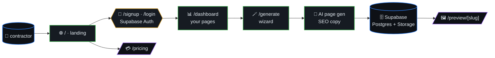
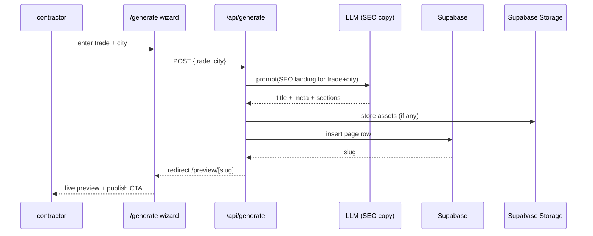
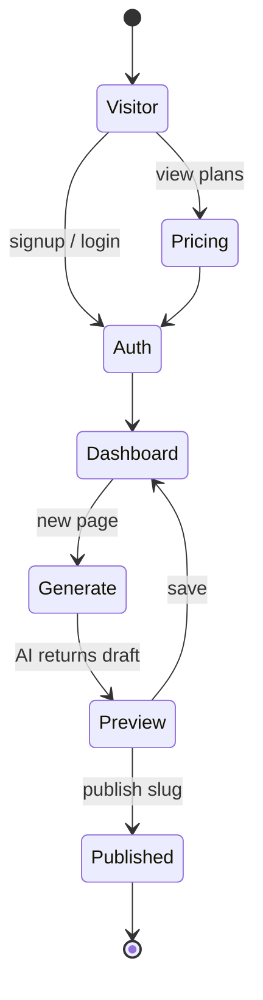
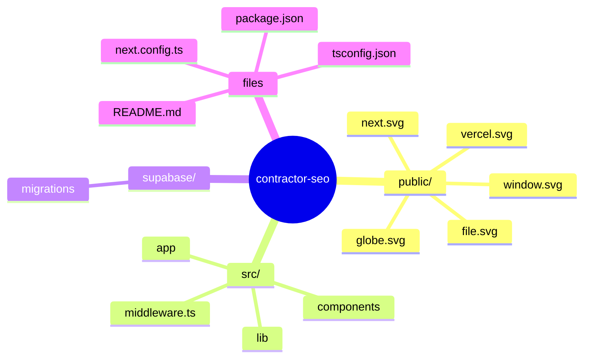

# ContractorSEO

> AI SEO page generator for contractors (HVAC, plumbing, electrical,
> roofing, landscaping, painting). Enter your trade + city, get a
> ready-to-publish landing page optimized for local search.



## Table of contents

- [Stack](#stack)
- [Architecture](#architecture)
- [Page generation (sequence)](#page-generation-sequence)
- [User flow (state)](#user-flow-state)
- [Getting Started](#getting-started)
- [Deploy](#deploy)
- [🗺️ Repository map](#️-repository-map)

## Page generation (sequence)



## User flow (state)



## Stack

- Next.js 16 + React 19 + Tailwind CSS 4
- Supabase (auth + database + storage)
- Vercel deployment
- TypeScript strict mode

## Architecture

- `/` — Landing page with demo
- `/signup`, `/login` — Auth flows (Supabase)
- `/dashboard` — User's generated pages
- `/generate` — Page generator wizard
- `/preview/[slug]` — Live preview of generated page
- `/pricing` — Plans (Free: 1 page, Pro: $19/mo unlimited)

## Getting Started

```bash
bun install
bun run dev
```

Open [http://localhost:3000](http://localhost:3000) in your browser.

You can start editing the page by modifying `src/app/page.tsx`. The page auto-updates as you edit the file.

## Deploy

The easiest way to deploy is via the [Vercel Platform](https://vercel.com/new). See the [Next.js deployment docs](https://nextjs.org/docs/app/building-your-application/deploying) for details.


## 🗺️ Repository map

Top-level layout of `contractor-seo` rendered as a Mermaid mindmap (auto-generated from the on-disk tree).


